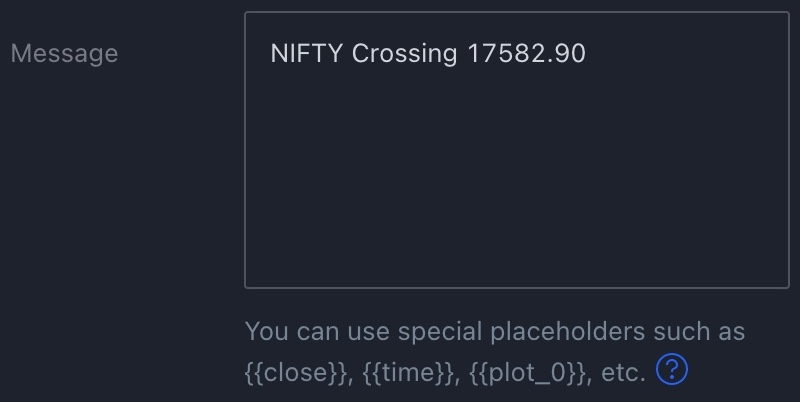
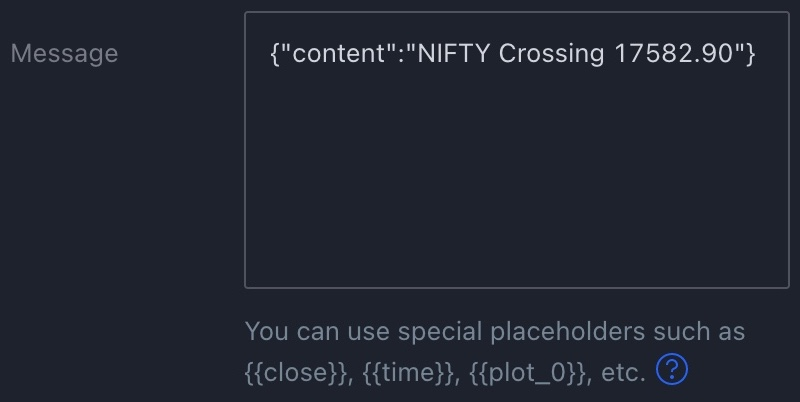

<div align="center">
<h1 align="center">Tradingview Discord Webhook Middleware</h1>
<br />
<br>

<br>
A middleware for sending tradingview webhook alerts to a discord channel without manually converting the alert message to required JSON format in tradingview alert dialogbox for every individual ticker.
</div>

***

## Problem it is solving
Default    |  Required
:-------------------------:|:-------------------------:
  |  

## Web Hosting guide
### Recommended web hosting options
All of the below mentioned options provide an amazing free tier to begin with:
1. Any cheap VPS or cloud providers compute instances like AWS EC2 or Oracle ARM
2. Deployment platforms like [pythonanywhere](https://www.pythonanywhere.com) or [fly.io](https://fly.io/)
### Keep the service awake on repl.it
Generally, while using a free tier of services like [repl.it](http://repl.it) and [heroku](https://heroku.com) they tend to sleep the service in case of inactivity, to overcome that we will be using two things:

- First, the [keep_alive.py](./keep_alive.py) module, using multi-threading we initiate another flask app
- Second, a website monitoring or pinger services like [Freshping](https://freshping.io) which will keep our service awake by sending constant GET request to the root route.

## Installation
```
pipenv install
```
or

```
pip -r requirements.txt
```

## Usage
```
python app.py
```

## License
This project is licensed under the MIT license